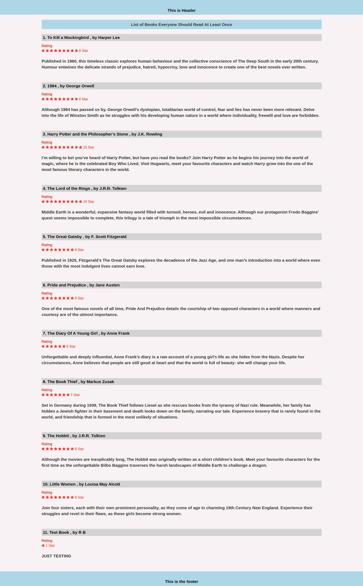
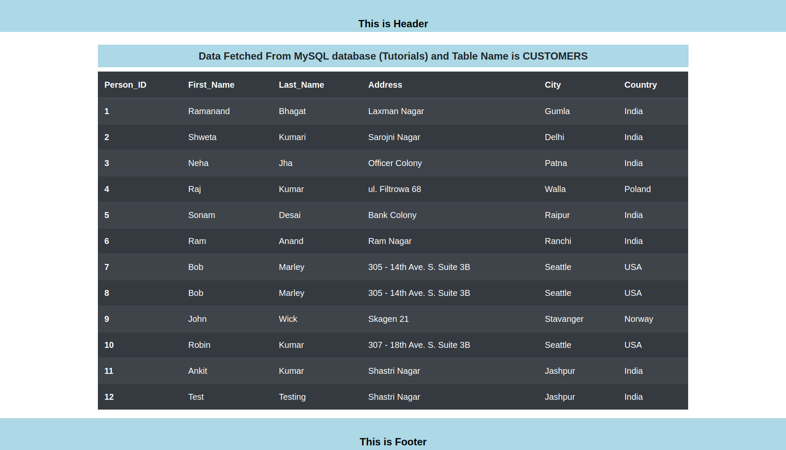

# Assignment

 

a simple python flask application with 2 endpoints '/PostgreSQL' and '/MySQL'. The application uses SQLAlchemy to fetch data from tables of your choice. The '/PostgreSQL' endpoint returns data from PostgreSQL database while '/MySQL' returns data from MySQL database within the single application. 

  

# Development server

 

Firstly configure the database settings in `app.py` file at line nos. `14 & 17 ` with your username , password , host and database. Open DB admin and then import from `mysql_db.sql` to `MySQL DB` and `pgsql_db.sql` to `PostgreSQL DB`.

  

Goto Project Directory in terminal and Install the required Dependencies ->  `pip install -r requirements.txt` . and run `python app.py` for a dev server. Navigate to `http://localhost:5000/`. The app will automatically reload if you change any of the source files.

  

# /PostgreSQL
 

  

# /MySQL

 

